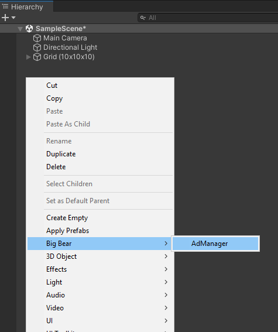
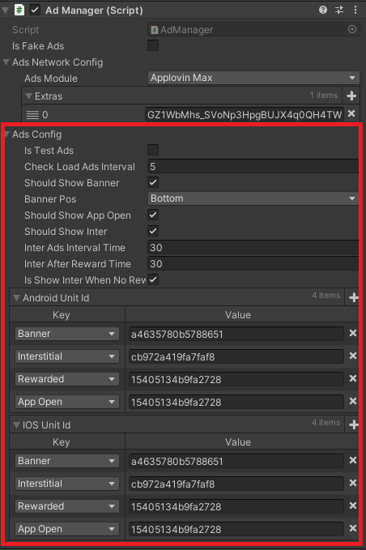

# Big Bear Ads

Package để hiển thị ads <br>
Mediation hỗ trợ

- Applovin

Các loại Ads hỗ trợ

- Banner
- Interstitial
- Rewarded
- AppOpen

## Hướng dẫn sử dụng

### cài đặt package

1. Trong Unity mở <b>Package Manager</b>
2. Chọn <b>Add Package from git URL...</b>
3. Điền url = https://gitlab.com/big-bear-team/packages/package-ads.git

### Setup

1. import các plugin Ads vào (Applovin Max).
2. Load các module ads bằng lệnh trên Menu : **Big Bear -> Reload Ads Module**
3. Kiểm tra xem trong Scripting Define Symbols xem có các plugin Ads chưa, nếu có rồi thì là thành công

- Applovin : **BB_APPLOVIN_MAX**

4. Thêm prefab **AdManager** vào trong scene, chuột phải vào Window **Hierarchy**, chọn option **Big Bear** -> **AdManager** <br>



5. Add Manifest
```xml
<manifest>
   <application android:networkSecurityConfig="@xml/network_security_config">
      ⋮
   </application>
</manifest>
```
6. Add fie res/xml/network_security_config.xml
```xml
<?xml version="1.0" encoding="utf-8"?>
<network-security-config>
    <!-- For AdColony and Smaato - all cleartext traffic allowed -->
    <base-config cleartextTrafficPermitted="true">
        <trust-anchors>
            <certificates src="system"/>
        </trust-anchors>
    </base-config>
    <!-- End AdColony cleartext requirement -->
    <domain-config cleartextTrafficPermitted="true">
        <!-- For Facebook -->
        <domain includeSubdomains="true">127.0.0.1</domain>

        <!-- For Amazon -->
        <domain includeSubdomains="true">amazon-adsystem.com</domain>
    </domain-config>
</network-security-config>
```
### Điều kiện

#### Các package cần thiết

1. <b>Big Bear Core</b> [(link)](https://gitlab.com/big-bear-team/packages/package-core.git)
2. **Sirenix Odin**

### Các tính năng

#### I. Các thông số Ads Config

1. Chỉnh sửa Ads Config ngay trong **AdManager**



2. Set ads config lúc runtime, bằng lệnh

```csharp
    AdManager.Instance.SetAdsConfig(AdsConfig _newAdsConfig);
```

3. Các Event của Ads

   **AdManager** sẽ bắn ra các Event của Ads như sau

```csharp
    //sự kiện ads bắt đầu
    public class AdsStartEvent : GameEvent
    {
        public AdsType adsType;
    }

    // sự kiện ads kết thúc
    public class AdsCloseEvent : GameEvent
    {
        public AdsType adsType;
    }
    
    // sự kiện ads được tính revenue
    public class AdsRevPaidEvent : GameEvent
    {
        public AdsType adsType;
        public string adUnitId;
        public double revenue;
    }
```

#### II. Banner

1. Set có show banner hay không

```csharp
    AdManager.Instance.SetShouldShowBanner(bool shouldShow);
```

2. Chủ động show và hide banner

```csharp
    AdManager.Instance.ShowBanner(BannerPos bannerPos;
    AdManager.Instance.HideBanner(BannerPos bannerPos;
```

Lưu ý: banner sẽ không show nếu đã `SetShouldShowBanner(false)`

#### III. Interstitial

1. Set có show Interstitial hay không

```csharp
    AdManager.Instance.SetShouldShowInter(bool shouldShow);
```

2. Show Inter

 ```csharp
    AdManager.Instance.ShowInterstitialAds(Action closeCallback = null);
```

#### IV. Rewarded

1. Show Rewarded

 ```csharp
    AdManager.Instance.ShowRewardedVideo(Action closeRewardCallback, Action skipRewardCallback, string placement = null);
```

#### V. AppOpen

**AdManager** sẽ tự động check show AppOpen Ads trong sự kiện `void OnApplicationPause(bool pauseStatus)`<br>
Lúc đầu game vào nếu muốn hiện AppOpen thì phải tự gọi thông qua hàm bên dưới

1. Set có show AppOpen hay không

```csharp
    AdManager.Instance.SetShouldShowAppOpen(bool shouldShow);
```

2. Show AppOpen

 ```csharp
    AdManager.Instance.ShowAppOpenAds(Action closeCallback = null);
```
3. 