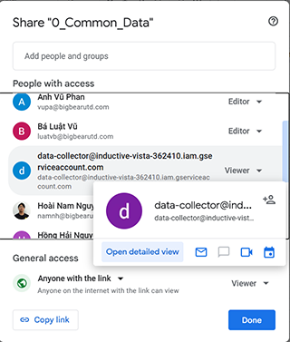
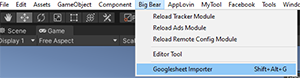
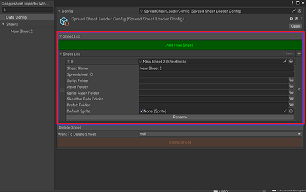
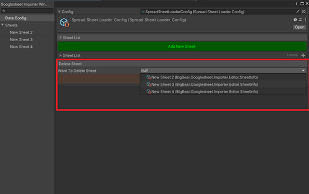
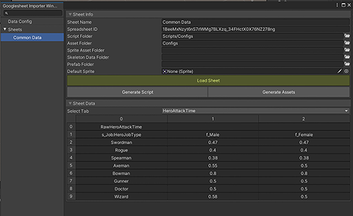

# Big Bear Googlesheet Importer

Package dùng để lấy data từ googlesheet theo phương thức Oauth 2.0 
Package có thể quản lý dữ liệu từ nhiều sheet khác nhau.

## Hướng dẫn sử dụng

### cài đặt package
1. Trong Unity mở <b>Package Manager</b>
2. Chọn <b>Add Package from git URL...</b>
3. Điền url = https://gitlab.com/big-bear-team/packages/package-googlesheet-importer.git

### Điều kiện
#### Có service account có thể truy cập google sheet
- account Id : **data-collector@valued-aleph-337304.iam.gserviceaccount.com**
- credential json file 
      Cách tạo tham khảo ở link: https://code-maze.com/google-sheets-api-with-net-core/
#### Các package cần thiết   
1. <b>Sirenix Odin package</b>: sử dụng odin để dựng các window
2. <b>Big Bear Core</b> [(link)](https://gitlab.com/big-bear-team/packages/package-core.git)

### Các tính năng
#### I. Thêm google sheet cần import data
1. Mở google sheet muốn import data,  share quyền truy cập cho account **data-collector@valued-aleph-337304.iam.gserviceaccount.com** với quyền **viewer**  
   
2. Mở **Googlesheet Importer Window**, vào Menu Item: **BigBear -> Googlesheet Importer**
 

3. Trong tab **Data Config** chọn **Add New Sheet**
4. Điền thông tin của sheet

- **Sheet Name** : tên của sheet
- **Spreadsheet ID** **(*)**: id của sheet lấy trên đường dẫn link của google sheet
- **Script Folder** **(*)**: đường dẫn đến folder chứa script sau khi được generate
- **Asset Folder** **(*)**: đường dẫn đến folder chứa Scriptable Object sau khi được generate
- **Sprite Folder** : đường dẫn đến folder chứa Sprite cho trường hợp có các field là sprite
- **Skeleton Folder** : đường dẫn đến folder chứa Skeleton Data cho trường hợp có các field là anim Spine
- **Prefab Folder** : đường dẫn đến folder chứa Prefab cho trường hợp có các field là prefab
- **Default Sprite** : là sprite default nếu không thể load được sprite như trong data  
các field có **(*)** là bắt buộc điền thông tin

#### II. Xóa sheet data
1. Trong tab **Data Config**, phần **Delete Sheet**, chọn sheet cần xóa trong dropdown, rồi bấm **Delete Sheet** 

#### II. Import Data từng sheet
1. Chọn sheet muốn import data bên menu trái
2. Điền thông tin vào **Sheet Info**
3. bấm **Load Sheet** để lấy data của sheet về
4. Chọn Tab muốn generate data trong phần **Select Tab**, Data của tab sẽ hiển thị ngay bên dưới
5. bấm **Generate Script** để generate script của tab đã chọn
6. bấm **Generate Assets** để generate ScriptableObject chứa data của tab đã chọn 

