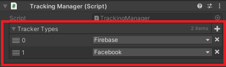

# Big Bear Tracking

Package để tracking event in game <br>
Các tracker hỗ trợ
- Firebase Analytics
- Facebook Analytics
- GameAnalytics

## Hướng dẫn sử dụng

### cài đặt package
1. Trong Unity mở <b>Package Manager</b>
2. Chọn <b>Add Package from git URL...</b>
3. Điền url = https://gitlab.com/big-bear-team/packages/package-tracking.git

### Setup

1. import và setup các plugin Tracking (Firebase, Facebook, GameAnalytics).
2. Load các module ads bằng lệnh trên Menu : **Big Bear -> Reload Tracker Module**
3. Kiểm tra xem trong **Scripting Define Symbols** xem có các plugin Ads chưa, nếu có rồi thì là thành công
- Firebase : **BB_FIREBASE_ANALYTIC**
- Facebook : **BB_FACEBOOK_ANALYTIC**
- GameAnalytics: **BB_GAMEANALYTIC**
4. Thêm prefab **TrackingManager** vào trong scene, chuột phải vào Window **Hierarchy**, chọn option **Big Bear** -> **TrackingManager** <br>
5. Thêm hoặc xóa module analytics muốn sử dụng trong **TrackingManager**



### Điều kiện
Trong project cần có các package sau để có thể dùng đc package Remote Config:
1. <b>Big Bear Core</b> [(link)](https://gitlab.com/big-bear-team/packages/package-core.git)

### Các tính năng
1. Sử dụng các hàm trong TrackingManager để track custom event

```csharp
void TrackEvent(string _eventName);
void TrackEvent(string _eventName, string _paramName, string _paramValue);
void TrackEvent(string _eventName, string _paramName, int _paramValue);
void TrackEvent(string _eventName, string _paramName1, string _paramValue1, string _paramName2, string _paramValue2);
void TrackEvent(string _eventName, string _paramName1, string _paramValue1, string _paramName2, int _paramValue2);
void TrackEvent(string _eventName, string _paramName1, int _paramValue1, string _paramName2, int _paramValue2);
void TrackEvent(string _eventName, string _paramName1, string _paramValue1, string _paramName2, string _paramValue2, string _paramName3, string _paramValue3);
void TrackEvent(string _eventName, string _paramName1, string _paramValue1, string _paramName2, string _paramValue2, string _paramName3, int _paramValue3);
void TrackEvent(string _eventName, params object[] parameterList);
```

2. Track user property

```csharp
void TrackUserProperty(string _propertyName, string _propertyValue);
```

3. Track sự kiện của level

```csharp
void TrackLevelStart(int level);
void TrackLevelCompleted(int level, int playTime);
void TrackLevelFail(int level, int playTime);
```